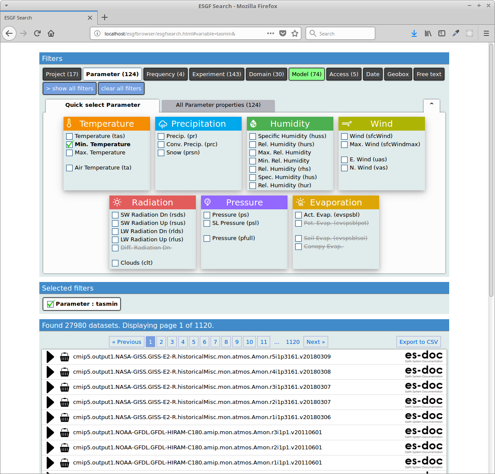

# ESGF Browser

The ESGF browser renders a search interface which is connected through adaguc-services with an Earth System Grid Federation (ESGF) node. It has been developed in the IS-ENES2 project in close collaboration with users. A user can select the search facets available in the ESGF node and is able to filter and downdrill search results. The interface tries to describe acronyms with more longer descriptive sentences. The interface includes a THREDDS catalog browser and is able to visualize opendap links with the adaguc-server and adaguc-viewer tools.

The components in this repository are extracted from the https://climate4impact.eu/impactportal/data/esgfsearch.jsp portal.
The plan is to rewrite this functionality using ReactJS.

# Related repositories:

* https://github.com/KNMI/adaguc-services/
* https://github.com/KNMI/adaguc-server/
* https://github.com/KNMI/adaguc-viewer/